# 낚시금지구역(No Fishing Zone)

> AI 기반 실시간 피싱/스캠 탐지 솔루션 for 국군 장병

## 개요

보안 사고에서 가장 중요한 것은 **사고가 일어나기 전에 막는 것**입니다. 이미 유출된 정보는 되돌릴 수 없기 때문입니다.

낚시금지구역은 장병이 링크를 클릭하는 순간, AI가 자동으로 해당 사이트를 분석하여 위험을 접속 전에 차단하는 사전 예방 시스템입니다.

## 문제 정의

보안 위협이라고 하면 시스템 해킹이나 변조 같은 기술적 공격을 떠올리기 쉽지만, 실제로 가장 많은 피해를 일으키는 것은 피싱이나 스캠처럼 사람을 속이는 공격입니다.

### 현황

- **국내 스미싱 발생**: 4,396건 (2024년 기준, 4년간 3.3배 증가)
- **국군 대상 외부 공격**: 매년 50% 증가
- **장병 연간 피해액**: 60~70억원 (스미싱 + 환전사기)

장병들은 일과 후 휴대전화로 다양한 서비스를 이용합니다. 수많은 링크를 직접 판단하는 것은 현실적으로 어렵고, 한 번 속는 순간 유출되는 것은 국가 안보와 직결된 정보일 수 있습니다.

## 솔루션

### 핵심 아이디어

클릭 한 번의 실수를 접속 전에 차단합니다.

장병이 링크를 클릭하는 순간, 실제 사이트에 접속하기 전에 AI가 먼저 해당 페이지를 방문하여 분석합니다. 위험한 사이트라면 경고를 표시하고, 안전하다면 바로 접속할 수 있게 합니다. 판단의 부담을 사용자에게 넘기지 않고, AI가 명확한 결과를 제공합니다.

### 작동 방식

```
링크 클릭 → 자동 인터셉트 → DB 조회 → DB에 없다면 실시간 AI 분석 → 판정
```

1. **자동 감지**: 사용자가 평소처럼 링크를 클릭하면, 앱이 이를 자동으로 인터셉트합니다
2. **즉시 분석**: 백엔드 서버가 해당 URL을 받아 DB를 먼저 조회합니다
3. **AI 판정**: DB에 없는 경우 React AI가 실시간으로 사이트를 분석하고 위험도를 평가합니다
4. **결과 표시**: 분석 결과(안전/경고/위험)를 사용자에게 보여줍니다

### 핵심 기능

**듀얼 AI 시스템**

- **React AI (실시간 분석 엔진)**: URL 유입 즉시 페이지의 맥락과 구조를 이해하여 3초 내에 위험 여부를 판별합니다.
- **Search AI (자율 수집 봇)**: 검색엔진처럼 인터넷을 스스로 돌아다니며, CertStream 실시간 모니터링을 통해 신규 피싱 사이트를 선제적으로 발견하고 DB를 자동 업데이트합니다.

**시스템 시너지**

- 데이터베이스를 업데이트하면, React AI의 사용 빈도가 줄어듭니다.  
  즉, 데이터가 누적될수록 실시간 분석 과정이 간소화되어, 시스템을 이용할수록 전체적인 응답 속도가 더욱 빨라지는 선순환 구조를 갖추고 있습니다.

**기술적 강점**

- **효율적인 아키텍처**: 독립 워커 구조를 채택하여 일부 수집 지점이 차단되더라도 전체 시스템은 중단 없이 가용성을 유지합니다.
- **자원 최적화**: Rust 기반 서버를 통해 메모리 안전성을 확보하고, 저자원 환경에서도 높은 처리 성능을 발휘하도록 설계했습니다.
- **정교한 탐지 기술**: 단순 필터링이 아닌 HTML 정제 분석 및 금융/쇼핑 공식 도메인 대조를 통해 사칭 사이트를 검증합니다.
- **사용자 경험(UX) 고려**: 하이브리드 렌더링(SSR+CSR)과 SSE(Server Sent Events)를 활용하여 빠른 응답 속도와 실시간 분석을 동시에 제공합니다.

## 기술 스택

### Front

|  | 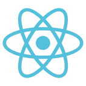 |  |  |
| :-----------------------------------------------------: | :----------------------------------------------------: | :----------------------------------------------------: | :-------------------------------------------------: |
|             [Next.js](https://nextjs.org/)              |             [React.js](https://react.dev/)             |           [Devup UI](https://devup-ui.com/)            |    [TypeScript](https://www.typescriptlang.org/)    |

### Server

|  |  |  |  |
| :---------------------------------------------------: | :-----------------------------------------------------: | :------------------------------------------------------: | :------------------------------------------------------: |
|          [Rust](https://www.rust-lang.org/)           |        [Sea ORM](https://www.sea-ql.org/SeaORM/)        |    [Vespera](https://github.com/dev-five-git/vespera)    | [Vespertide](https://github.com/dev-five-git/vespertide) |

### Android

|  | 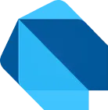 | 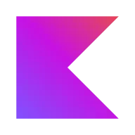 |
| :------------------------------------------------------: | :---------------------------------------------------: | :------------------------------------------------------: |
|             [Flutter](https://flutter.dev/)              |               [Dart](https://dart.dev/)               |            [Kotline](https://kotlinlang.org/)            |

## AI

| 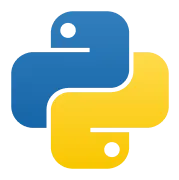 | 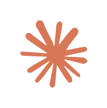 |  |  |
| :-----------------------------------------------------: | :-----------------------------------------------------: | :------------------------------------------------------: | :------------------------------------------------------: |
|            [Python](https://www.python.org/)            |         [Anthropic](https://www.anthropic.com/)         |         [Fastapi](https://fastapi.tiangolo.com/)         |           [Uvicorn](https://www.uvicorn.org/)            |

## 아키텍처

### 전체 구조

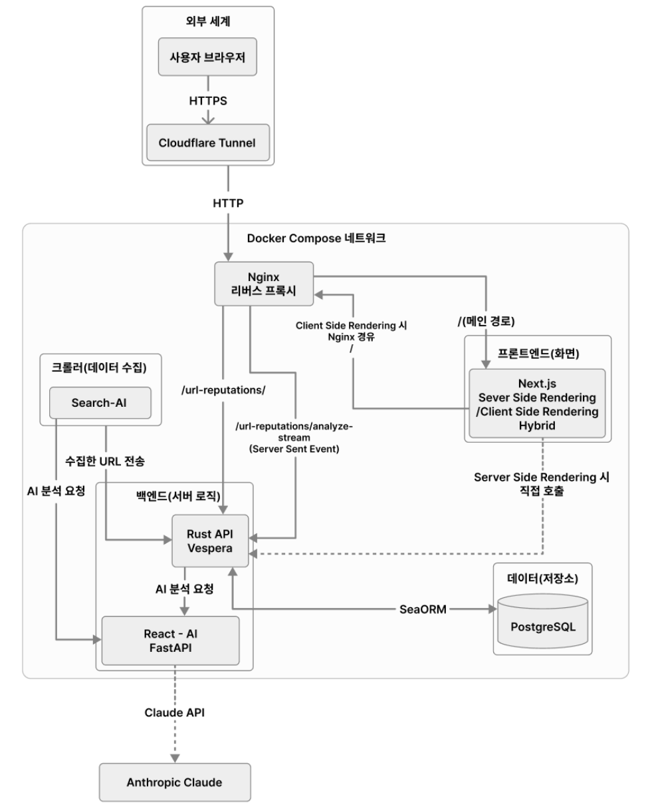

### 시스템 구성

| Layer        | Technology          | Purpose                                | 주요 기능                         |
| ------------ | ------------------- | -------------------------------------- | --------------------------------- |
| **Mobile**   | Flutter             | URL 인터셉트, 사용자 인터페이스        | 링크 클릭 감지, 검증 결과 표시    |
| **Backend**  | Rust (Axum)         | 고성능 API 서버, 저자원 최적화         | API 라우팅, DB 연동, SSE 스트리밍 |
| **AI**       | Python (Claude API) | 실시간 분석, 자율 크롤링               | 사이트 분석, 위험도 평가          |
| **Frontend** | Next.js             | 분석 결과 페이지                       | SSR/CSR, 실시간 분석 UI           |
| **Database** | PostgreSQL          | 위협/안전 정보 저장                    | URL 평판 캐싱, 분석 이력 관리     |
| **Infra**    | Docker, Nginx       | 컨테이너 오케스트레이션, 리버스 프록시 | 서비스 격리, 트래픽 라우팅        |

### 데이터 흐름

**시나리오 1 - 캐시 히트** (저장된 URL)

1. 사용자 링크 클릭 → 2. URL 인터셉트 → 3. DB 조회 성공 → 4. 즉시 결과 반환

**시나리오 2 - 신규 분석** (처음 보는 URL)

1. 사용자 링크 클릭 → 2. URL 인터셉트 → 3. DB 조회 실패 → 4. React AI 실시간 분석 → 5. 분석 결과 DB에 저장 및 결과 반환

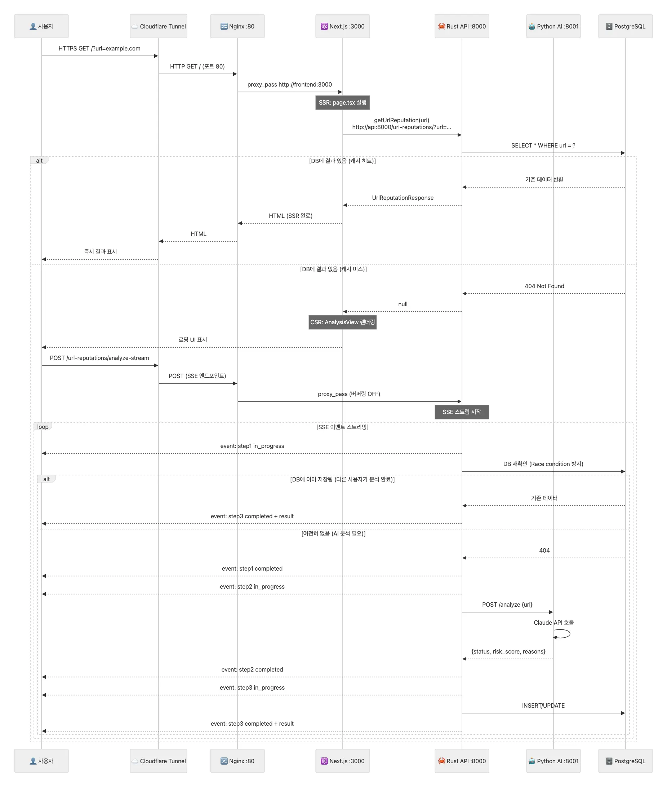

---

## 프로젝트 구조

```bash
├── app/                # Flutter 모바일 앱 (URL 인터셉트, 사용자 인터페이스)
├── backend/            # Rust API 서버 (비즈니스 로직, DB 연동)
├── frontend/           # Next.js 웹 (분석 결과 페이지)
├── react-ai/           # 실시간 AI 분석 엔진 (Python, FastAPI, Claude API)
├── search-ai/          # 자율 위협 수집 크롤러 (Python, Playwright)
├── nginx/              # 리버스 프록시 (트래픽 라우팅)
└── docker-compose.yml  # 인프라 오케스트레이션
```

## 데모

### 발표 영상

[🎥 발표 영상](https://youtu.be/my0cum_Loy8?si=JH4iWuowXXf8_w1t)

### 주요 화면

|                                    분석 화면                                     |                                   위험 화면                                   |                                   경고 화면                                   |                                 안전 화면                                  |                                  미존재 화면                                   |
| :------------------------------------------------------------------------------: | :---------------------------------------------------------------------------: | :---------------------------------------------------------------------------: | :------------------------------------------------------------------------: | :----------------------------------------------------------------------------: |
| 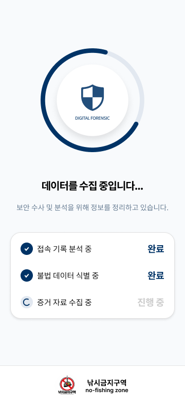 | 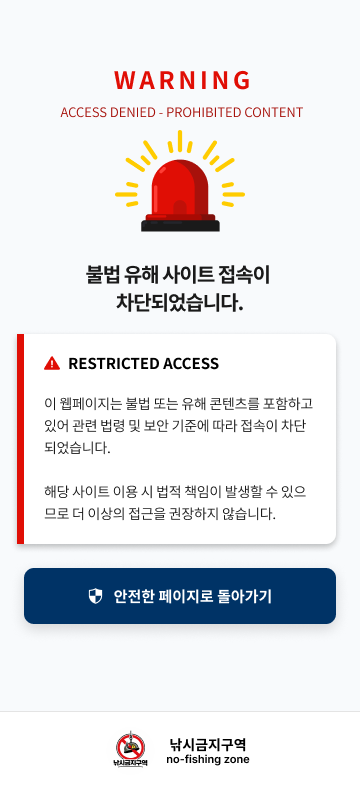 | 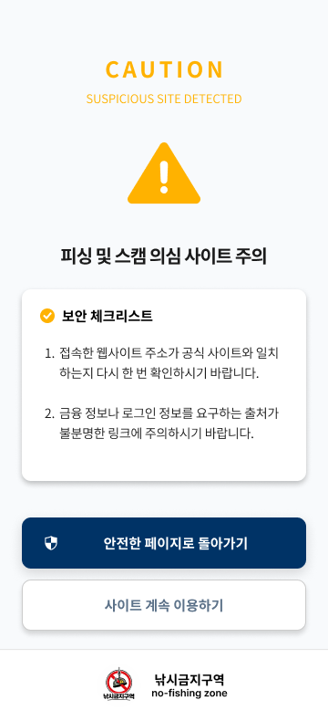 | 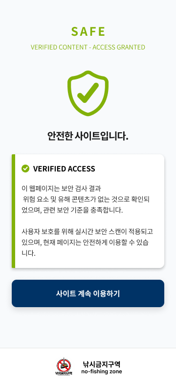 | 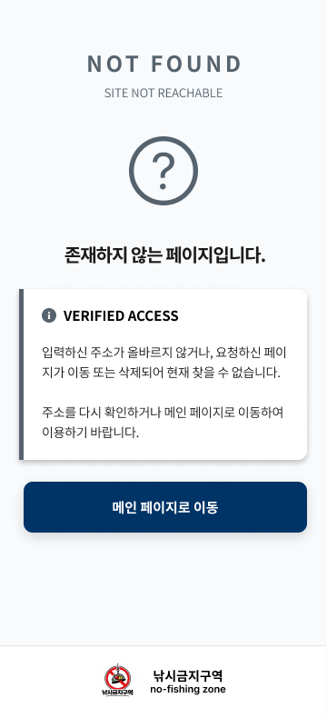 |

## 팀 역할

|                                          프로필                                           |                      이름                       |        역할         |                담당 영역                |
| :---------------------------------------------------------------------------------------: | :---------------------------------------------: | :-----------------: | :-------------------------------------: |
|   |  [이상희(팀장)](https://github.com/sanghee01)   | Full-stack Engineer |     Frontend, Backend, 인프라 구축      |
|  | [문건호(팀원)](https://github.com/snoopuppy582) |     AI Engineer     | React AI, Search AI 개발 및 모델 최적화 |
|   |   [오병희(팀원)](https://github.com/dev07060)   |  Mobile Developer   |   Android 앱 개발, URL 인터셉트 구현    |
|   |   [오정민(팀원)](https://github.com/owjs3901)   |   Project Manager   |            총괄 및 아키텍터             |
|                       |                  오수정(팀원)                   |      Designer       |  서비스 UI 디자인 및 와이어프레임 설계  |
