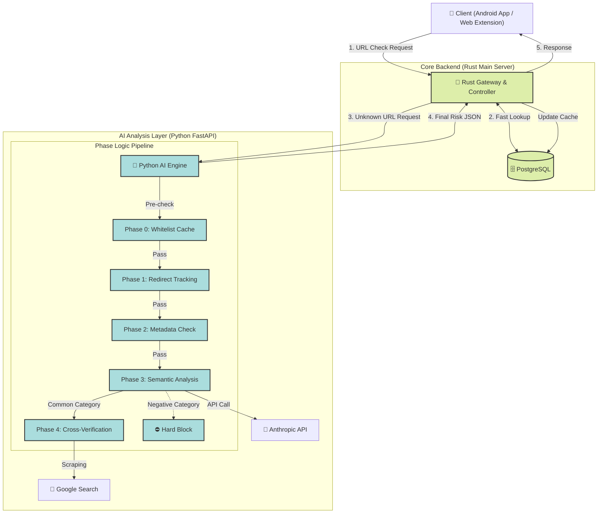

본 Python AI 서버는 지능형 스캠 탐지 시스템의 전체 아키텍처 중 '심층 분석'을 담당하는 핵심 모듈입니다.

본 문서는 Antigravity 및 Claude Code 등 AI 코딩 에이전트가 전체 시스템 흐름을 파악하고, Rust 메인 서버 등 타 구성 요소와 원활하게 연동되는 코드를 생성할 수 있도록 가이드하는 통합 설계도입니다.

최신 기술 사양(Claude Haiku 4.5)과 분석 파이프라인(Phase 0~4)을 반영한 [지능형 스캠 탐지 시스템 전체 아키텍처 Ver.2]를 정의하며, 이는 모든 개발자 및 AI 에이전트가 준수해야 할 공통 표준 사양입니다.

---

# Intelligent Scam Detection System

## 1. 시스템 개요 (System Overview)

이 프로젝트는 **MSA(Microservices Architecture)** 기반의 보안 솔루션으로, 사용자가 접속하려는 URL의 안전성을 실시간으로 판별합니다.

**Rust Main Server**가 전체 트래픽을 관제하며, **Python AI Server**는 미확인 위협에 대한 '심층 분석(Deep Analysis)'을 담당하는 전문 분석 엔진 역할을 수행합니다.

## 2. 전체 아키텍처 다이어그램 (Full Architecture)



---

## 3. 구성 요소별 역할 및 데이터 흐름 (Roles & Data Flow)

### A. 🦀 Rust Main Server (Gateway & DB Manager)

- **역할:** 시스템의 **Control Tower**. 모든 트래픽의 진입점이며 DB와의 직접적인 통신을 담당합니다.
- **주요 기능:**

1. **DB 조회 (Clustered Data):** 요청된 URL이 이미 DB에 존재하는지(Black/Whitelist) 확인합니다.
2. **부하 분산:** 이미 아는 URL은 Python 서버로 보내지 않고 즉시 응답하여 Python 서버의 부하와 API 비용을 절감합니다.
3. **데이터 동기화:** Python 서버가 분석한 새로운 결과를 DB에 저장(Update)하여, 이후 동일 요청 시 캐싱된 결과를 반환합니다.

### B. 🐍 Python AI Server (Deep Analysis Engine)

- **역할:** Rust 서버가 식별하지 못한 **"Unknown URL"**을 0부터 100까지 해부하는 **특수 분석 엔진**입니다.
- **기술 스택:** FastAPI, HTTPX, BeautifulSoup4, tldextract, python-whois, Anthropic Client
- **분석 파이프라인 (The 5-Step Logic):**

### 🛑 **Phase 0: 메모리 캐싱 (Pre-Filtering)**

- **목적:** Rust 서버 단에서 걸러지지 않은 요청 중, Python 서버 내부의 로컬 화이트리스트(Top 1000 Domains)로 한 번 더 방어하여 API 호출 비용을 0원으로 만듭니다.

### 🔄 **Phase 1: 네트워크 보안 (Redirect & Loop)**

- **목적:** 추적 회피용 '다중 리다이렉트' 및 '무한 루프' 공격 탐지.
- **로직:** 리다이렉트 1회당 **+5점**, 20회 초과 시 **강제 차단**.

### 📝 **Phase 2: 메타데이터 휴리스틱 (Metadata)**

- **목적:** 도메인의 '출신 성분' 검사.
- **로직:**
- **New Domain:** 생성 14일 이내 → **+15점**.
- **Bad TLD:** .xyz, .top 등 → **+10점**.

### 🧠 **Phase 3: AI 문맥 분석 (Claude Haiku 4.5)**

- **목적:** HTML 본문을 이해하여 카테고리(금융 vs 도박) 분류.
- **비용 최적화:** <script>, <style> 제거 후 핵심 텍스트만 전송 (토큰 70% 절감).
- **분기:**
- **Negative (도박/음란물):** Phase 4 생략하고 **즉시 차단**.
- **Common (금융/쇼핑):** Phase 4로 진행.

### 🔎 **Phase 4: 사칭 및 교차 검증 (Cross-Verification)**

- **목적:** "신한은행"이라 주장하는데 주소가 이상한지 확인 (Typosquatting 탐지).
- **로직:**
- 추출된 Keyword(예: "신한은행")로 구글 검색.
- 상위 결과 도메인과 현재 접속 도메인 비교.
- **유사 변조(shinhann.com):** **+50점 (결정타)**.
- **결과 없음:** **+30점**.

---

## 4. API 규격 (Interface Specification)

### A. 🦀 Rust Main Server API (클라이언트 ↔ Rust)

Rust 서버는 클라이언트(앱/브라우저)와 통신하며, 다음 API를 제공합니다.

#### **1) URL 평판 조회 (GET)**

**Endpoint:** `GET /url-reputations?url={url}`

**Query Parameters:**

- `url` (string, required): 조회할 URL

**Response (200 OK):**

```json
{
  "url": "http://example-phishing.xyz",
  "description": "Redirect count: 2 (+10), New domain < 14 days (+15), Suspicious TLD .xyz (+10), Typosquatting detected (+50)",
  "score": 95,
  "status": "BLOCK"
}
```

**Response (404 Not Found):**

- DB에 해당 URL이 없을 경우 (→ Rust는 Python AI에 분석 요청)

---

#### **2) URL 평판 등록/업데이트 (POST)**

**Endpoint:** `POST /url-reputations`

**Request Body:**

```json
{
  "url": "http://shinhann-bank-event.xyz",
  "description": "Redirect count: 2 (+10), New domain < 14 days (+15), Suspicious TLD .xyz (+10), Typosquatting detected (+50)",
  "score": 95,
  "status": "BLOCK"
}
```

**Response (200 OK):**

```json
{
  "url": "http://shinhann-bank-event.xyz",
  "description": "Redirect count: 2 (+10), New domain < 14 days (+15), Suspicious TLD .xyz (+10), Typosquatting detected (+50)",
  "score": 95,
  "status": "BLOCK"
}
```

**필드 설명:**

- `url` (string): 평가 대상 URL
- `description` (string, optional): 분석 결과 상세 설명 (Phase별 점수 내역)
- `score` (integer, 0-100): 위험도 점수 (높을수록 위험)
- `status` (enum): URL 상태
  - `"SAFE"`: 안전 (0-40점)
  - `"WARNING"`: 경고 (41-70점)
  - `"BLOCK"`: 차단 권장 (71-100+점)

---

### B. 🐍 Python AI Server API (Rust ↔ Python)

**Python AI Server**는 오직 Rust 서버와 통신하며, 아래 포맷을 준수합니다.

#### **Endpoint:** `POST /analyze`

**Request (from Rust):**

```json
{
  "url": "http://shinhann-bank-event.xyz",
  "request_id": "550e8400-e29b-41d4-a716-446655440000"
}
```

**Response (to Rust):**

```json
{
  "url": "http://shinhann-bank-event.xyz",
  "reasons": [
    "Redirect count: 2 (+10)",
    "New domain < 14 days (+15)",
    "Suspicious TLD .xyz (+10)",
    "Typosquatting detected (+50)"
  ],
  "risk_score": 95,
  "status": "BLOCK",
  "category": "Common",
  "keyword": "신한은행"
}
```

**Python AI는 반드시 Rust API 스펙에 맞춰 응답해야 합니다. (Rust 서버가 내부적으로 매핑함)**

- `risk_score` -> `score`
- `reasons` (list) -> `description` (joined string)

**점수 및 상태 기준:**

- `0-40점` → `status: "SAFE"` (안전)
- `41-70점` → `status: "WARNING"` (경고)
- `71-100+점` → `status: "BLOCK"` (차단 권장)

---

## 5. 개발자를 위한 가이드 (For Developers & AI Agents)

이 문서를 바탕으로 개발을 진행할 때 다음 지침을 따르십시오.

1. **AI 코딩 시:** 이 전체 아키텍처 문서를 프롬프트의 최상단에 붙여넣어, AI가 **"나는 Rust 서버의 하위 모듈인 Python 엔진을 만드는구나"**라고 맥락을 이해하게 하십시오.
2. **DB 연결 제외:** Python 서버 코드 내에 DB 연결 로직을 작성하지 마십시오. 모든 DB 작업은 Rust 서버가 수행합니다.
3. **환경 변수:** ANTHROPIC_API_KEY와 같은 민감 정보는 반드시 .env 파일로 관리하십시오.
4. **비동기 필수:** HTTPX와 Playwright(Phase 4 검색용) 사용 시 반드시 async/await 패턴을 사용하여 Rust 서버의 요청을 지연시키지 않도록 하십시오.
